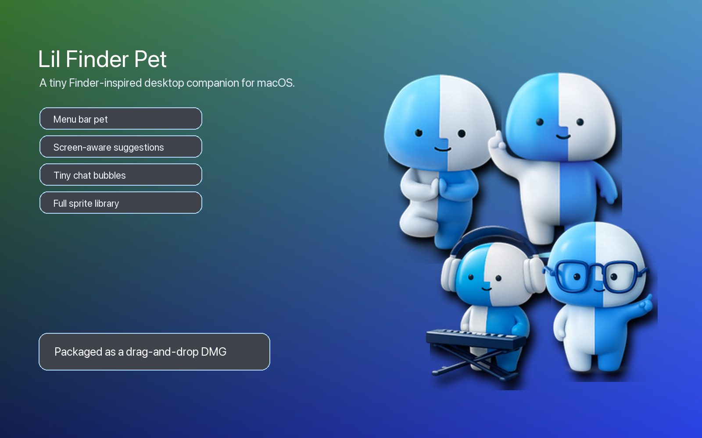
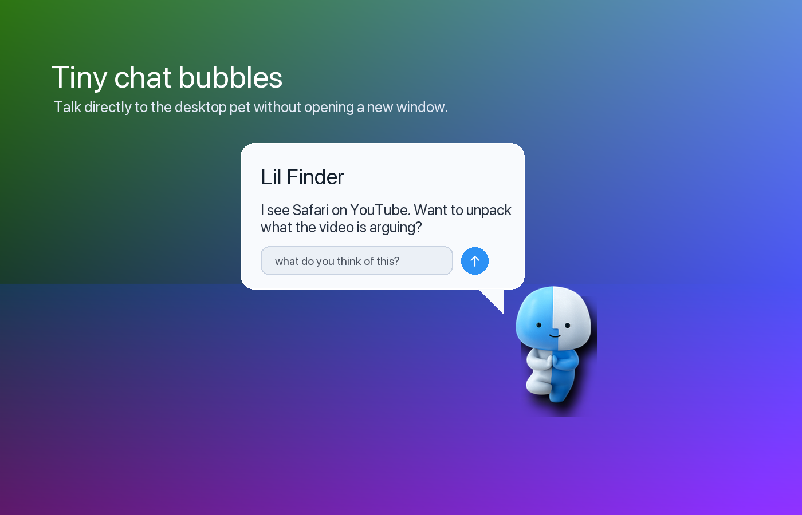
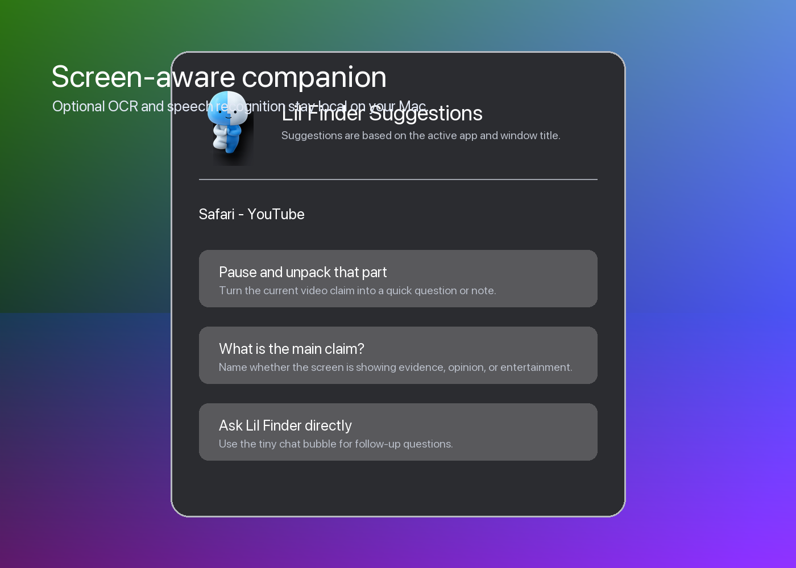
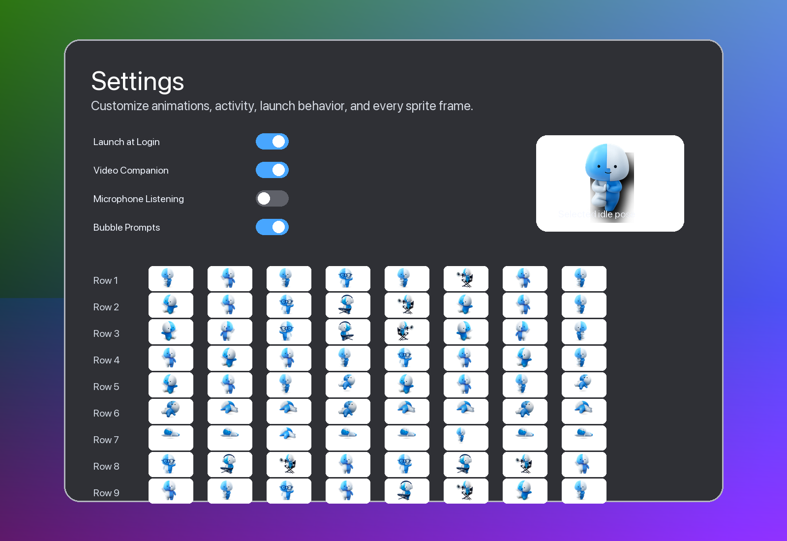
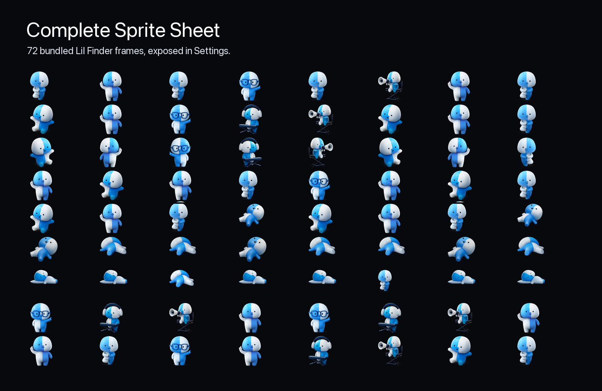

# Lil Finder Pet



Lil Finder Pet is a tiny Finder-inspired desktop companion for macOS. It lives as a floating pet plus a menu bar app, uses a full 72-frame sprite sheet, and can react to the active app with lightweight local suggestions.

## Screenshots

| Chat bubble | Suggestions |
| --- | --- |
|  |  |

| Settings and sprites | Full sprite sheet |
| --- | --- |
|  |  |

## Features

- Floating transparent desktop pet.
- Colored Finder-style menu bar icon.
- Tiny chat bubble prompts attached to the pet.
- Context-aware suggestions based on the active app and window.
- Optional Screen Recording OCR using Apple Vision.
- Optional Video Companion mode with microphone and Speech Recognition.
- Launch at Login toggle.
- Full animation settings with all 72 bundled sprites exposed by row.
- Adjustable animation pacing, pet size, activity level, and scan interval.
- Drag-and-drop DMG packaging.

## Download

The built DMG is included under:

```text
dist/LilFinderPet.dmg
```

Open the DMG, drag `LilFinderPet.app` into `/Applications`, then launch it from Applications. The app runs as a menu bar accessory, so it does not show a Dock icon.

## Privacy

Lil Finder Pet runs locally. It does not send screen contents, microphone audio, or speech transcripts to a server.

Optional permissions:

- **Screen Recording**: enables OCR from the active window using Apple Vision.
- **Microphone**: enables Video Companion listening when you explicitly turn it on.
- **Speech Recognition**: transcribes microphone audio locally through Apple Speech APIs for video comments and questions.

## Build

Requires macOS 14 or newer and Swift 6 tooling.

```bash
swift build -c release --product LilFinderPet
```

## Package

```bash
./scripts/package.sh
```

The packaging script builds the release executable, creates `dist/LilFinderPet.app`, ad-hoc signs it, and creates `dist/LilFinderPet.dmg`.

## Notes

This is a local desktop toy/assistant inspired by Finder-style character art. It is intentionally quiet by default: full suggestion windows do not auto-open during routine context scans, and microphone listening stays off until enabled in Settings.
